  

  

 

## 💫 About Me

🔭 building an HTTP load balancer in Go  
🌱 going deep on Linux and how services fail  
💬 Python, C++, Docker, GitLab  
⚡ I like when the logs tell you the truth

## 🌐 Socials

[LinkedIn](https://www.linkedin.com/in/baqerhassani) · [Email](mailto:bagherhasani0@gmail.com) · [GitHub](https://github.com/bagherhasani)

## 💻 Tech Stack

<table>
  <tr>
    <td align="center" width="90"> Linux</td>
    <td align="center" width="90"> Python</td>
    <td align="center" width="90"> C++</td>
    <td align="center" width="90"> Go</td>
    <td align="center" width="90"> Bash</td>
    <td align="center" width="90"> Docker</td>
    <td align="center" width="90"> Git</td>
  </tr>
  <tr>
    <td align="center"> GitLab</td>
    <td align="center"> GitHub Actions</td>
    <td align="center"> MySQL</td>
    <td align="center"> Nginx</td>
    <td align="center"> Azure</td>
    <td align="center"> FastAPI</td>
    <td align="center"> Grafana</td>
  </tr>
</table>

## 📊 GitHub Stats

